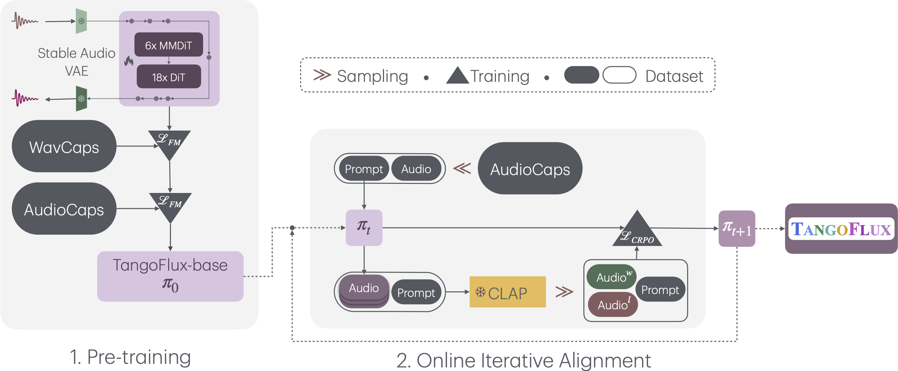

# Overall Pipeline

TangoFlux consists of FluxTransformer blocks, which are Diffusion Transformers (DiT) and Multimodal Diffusion Transformers (MMDiT) conditioned on a textual prompt and a duration embedding to generate a 44.1kHz audio up to 30 seconds long. TangoFlux learns a rectified flow trajectory to an audio latent representation encoded by a variational autoencoder (VAE). TangoFlux training pipeline consists of three stages: pre-training, fine-tuning, and preference optimization with CRPO. CRPO, particularly, iteratively generates new synthetic data and constructs preference pairs for preference optimization using DPO loss for flow matching.

